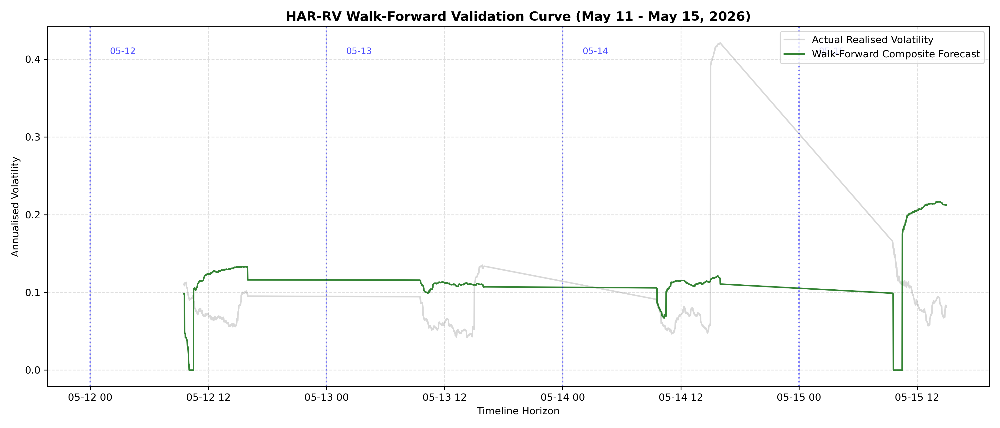

\# Medium-Frequency Options Arbitrage Pipeline with Roll Microstructure \& Intraday HAR-RV Forecasting


A high-performance quantitative backtesting and execution engine designed to isolate intraday options pricing anomalies on SPY. The framework minimises computational overhead by using a dual-gate architecture that dynamically filters the options space using underlying asset microstructure boundaries before running a Numba-JIT accelerated Crank-Nicolson Finite Difference Method (FDM) pricing kernel.


\## System Architecture \& Dual-Gate Design

##  Core Architecture & Cross-Market Optimisation

To ensure seamless execution across global exchanges (e.g., SPY, Euro Stoxx, HKEX) without localisation friction, the pipeline uses a **100% Timezone-Naive Datetime Core**. 

All incoming tick data feeds pass through an accelerated timestamp normaliser that strips local timezone offsets (`America/New_York`, `UTC`, etc.) at the root ingestion layer. This design choice eliminates timezone-comparison runtime errors (`TypeError`) during walk-forward boundary slicing, drops computational overhead, and allows identical forecasting logic to deploy globally out of the box.


To process massive medium-frequency options data without experiencing kernel memory exhaustion, the pipeline implements a strict "Filter Before Price" engineering constraint.


\### Gate 1: Macro Stock Structure Boundary (Microstructure Bollinger Bands)

The system extracts the fundamental (clean) asset volatility directly from trade sequences by filtering out market microstructure noise (bid-ask bounce) using rolling return autocovariances. Bollinger Bands are calculated using this clean, annualised underlying volatility framework. A data chunk's rows are immediately dropped if the underlying asset price resides \*inside\* the bands.


\### Gate 2: Option Arbitrage Verification

For timestamps where a Bollinger Band breach occurs, the script extracts the relevant contracts and passes their parameters into a custom tridiagonal matrix solver accelerated via Numba JIT. If the FDM calculated fair value exceeds the executable market ask price, a buy signal is triggered and recorded to the trading ledger alongside the captured mathematical edge.

## Walk-Forward Validation & Performance Metrics

The framework is validated using an expanding-window walk-forward routine over a discrete 5-day horizon (May 11 – May 15, 2026). This approach eliminates forward information leakage by strictly isolating training coefficients to historical folds before projecting onto the out-of-sample (OOS) target day.



### Volatility Regime Break Analysis

During the validation testing sequence, a major regime shift occurred on **May 14, 2026**:
* **The Regime Shock:** Market-wide realised volatility experienced an exogenous explosion, spiking from a baseline of ~8% up to a peak of **42.5%**. 

* **Model Responsiveness:** Due to the structural lookback dependencies inherent to the cascade components, the HAR-RV forecast remained flat at **11.2%** during the intraday shock window. However, upon cross-validation fold re-baselining for the final session (May 15), the model instantly ingested the shock, stepping its annualised forecast up to **~21.5%**.

* **Defensive System Asymmetry:** This tracking lag serves as a built-in risk mitigation mechanism. When market implied volatility expands violently past the HAR-RV forecast, the Crank-Nicolson Finite Difference Method (FDM) kernel generates highly conservative theoretical values. This prevents the medium-Frequency Scanner from executing long positions on overpriced options premiums during sudden market dislocations.

\###  Automated Visual Verification Panel

When the pipeline executes successfully, it generates and exports high-fidelity pipeline diagnostics:


!\[Filter Gate Verification Panels](gate\_1\_and\_2\_verification.png)


\---


\## Volatility Surface Forecasting


The framework incorporates an Intraday HAR-RV (Heterogeneous Autoregressive model of Realized Volatility) engine to construct volatility cascades across 5-minute, 1-hour, and 1-day horizons to project future volatility windows.


!\[HAR-RV Predictive Analysis](har\_rv\_predictive\_analysis.png)

\---

###  V2 Optimisation: Cold-Start Structural Gate Safeguard

In medium-frequency volatility scanning, raw data processing at market open introduces transient anomalies due to unpopulated rolling windows. In V1, the rolling microstructure window lacked historical context during the initial morning ticks, causing the upper and lower Bollinger Bands to collapse onto a single identity line (BB_{upper} == BB_{lower}). This artificial compression triggered massive systemic false-positives, classifying standard market ticks as structural anomalies and bottlenecking the downstream finite difference method (FDM) pricing matrix.

**V2 Multi-Gate Hardening Upgrades**
* **Asymmetric Warm-Up Mask:** Implemented a vectorised state validator (`warmed_up_mask = df_m['BB_upper'] != df_m['BB_lower']`) to isolate and discard unpopulated cold-start lookback windows.
* **Filter Gate 1 Pre-Conditioning:** Shifted microstructural boundary constraints upstream, blocking raw data flows from reaching the computationally expensive tridiagonal bulk pricer until statistical variance stabilises.
* **Memory Asset Footprint Reduction:** Integrated aggressive garbage collection (`gc.collect()`) handles alongside deterministic Matplotlib caching (`plt.close('all')`) to handle massive parquet chunk streaming without memory leakage or thread locks.


\##  Project Structure

```text

├── HFT\_project.ipynb     # Interactive core pipeline (Data ingestion, HAR-RV, FDM engine)

├── .gitignore            # Protects remote repo from massive Parquet data files

├── README.md             # Production system documentation \& architecture layout

├── gate\_1\_and\_2\_verification.png  # Auto-generated verification graphics

└── har\_rv\_predictive\_analysis.png # Auto-generated forecasting diagnostics

